# Conception
## Conception - App de Réservation de Places de Cinéma

## 1. Modèle de Données
### Diagramme Entité-Association (Sprint 1)

### Diagramme Entité-Association mis à jour
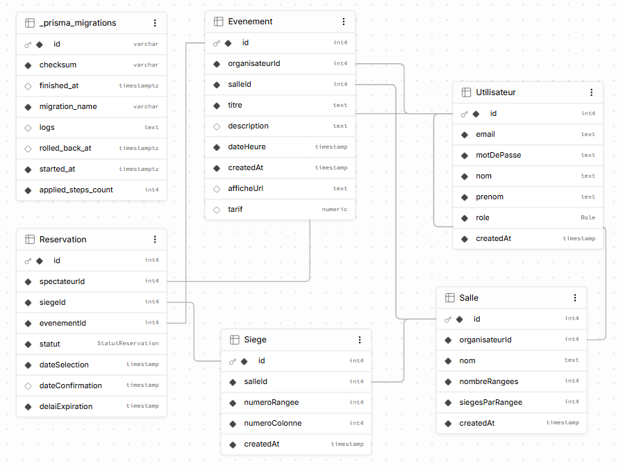

### Détails des Entités — Sprint 1
### UTILISATEURS (Inscription/Connexion)
id : Entier, clé primaire
email : Chaîne, unique (index pour login)
mot_de_passe : Hash bcrypt (jamais stocké en clair)
nom, prenom : Chaînes obligatoires
role : ENUM('spectateur', 'organisateur', 'admin')
spectateur : Consulte événements, réserve sièges, annule ses réservations
organisateur : Crée salles/événements, voit stats de vente, annule toute réservation
admin : Accès complet
created_at : Timestamp création

### SALLES (Créées par organisateur)
id : Entier, clé primaire
organisateur_id : FK → UTILISATEURS (non nul, créateur)
nom : Chaîne (ex: "Salle du Cégep", "Théâtre Principal")
nombre_rangees : Entier (ex: 10 rangées)
sieges_par_rangee : Entier (ex: 15 sièges par rangée)
created_at : Timestamp
Contrainte : UNIQUE(organisateur_id, nom) — un organisateur a une salle unique par nom

### SIEGES (Générés à partir de SALLES)
id : Entier, clé primaire
salle_id : FK → SALLES (non nul)
numero_rangee : Entier (1 à nombre_rangees)
numero_colonne : Entier (1 à sieges_par_rangee)
created_at : Timestamp
Contrainte : UNIQUE(salle_id, numero_rangee, numero_colonne) — pas de siège dupliqué
Pas de statut ici — le statut est dans RESERVATIONS pour chaque événement (un siège peut être libre pour l'événement A et réservé pour l'événement B)

### EVENEMENTS (Créés par organisateur, associés à une salle)
id : Entier, clé primaire
organisateur_id : FK → UTILISATEURS (non nul, créateur)
salle_id : FK → SALLES (non nul, immuable après création)
titre : Chaîne (ex: "Concert des Anciens")
description : Texte court
date_heure : DateTime (ex: 2024-10-15 20:00:00, en UTC)
created_at : Timestamp
Pas de état "complet" — calculé dynamiquement depuis les réservations confirmées

### RESERVATIONS (Associe spectateur + siège + événement)
id : Entier, clé primaire
spectateur_id : FK → UTILISATEURS (non nul)
siege_id : FK → SIEGES (non nul)
evenement_id : FK → EVENEMENTS (non nul)
statut : ENUM('en_selection', 'confirmee', 'annulee')
en_selection : Siège sélectionné, en attente de confirmation (délai limité)
confirmee : Siège réservé définitivement
annulee : Réservation annulée (siège libéré)
date_selection : Timestamp (quand le siège a été cliqué)
date_confirmation : Timestamp NULL (rempli seulement quand confirmee)
delai_expiration : Timestamp (date jusqu'à laquelle en_selection reste valide)
Contrainte critique : UNIQUE(siege_id, evenement_id) → un siège ne peut être réservé qu'une fois par événement
Contrainte : Si statut = 'confirmee', date_confirmation est non nul

## 2. Routes Principales
### Sprint 1 — Routes Détaillées
 
#### Authentification
| Méthode | Route | Rôle | Détails |
|---------|-------|------|---------|
| POST | `/api/auth/register` | Inscription publique | Corps : `{ email, password, nom, prenom }`. Réponse : `{ token, user }`. Génère JWT. |
| POST | `/api/auth/login` | Connexion publique | Corps : `{ email, password }`. Réponse : `{ token, user }`. Valide mot de passe avec bcrypt. |
| POST | `/api/auth/logout` | Déconnexion | Invalide le token côté client (revoke optionnel côté serveur). |
| GET | `/api/auth/me` | Profil utilisateur | Retour : données de l'utilisateur connecté. Auth requise (header: `Authorization: Bearer <token>`). |

#### Films (Public)
| Méthode | Route | Rôle | Détails |
|---------|-------|------|---------|
| GET | `/api/films` | Lister films | Pagination optionnelle (10 par page). Retour : liste complète avec `id, titre, genre, duree_minutes, affiche_url`. |
| GET | `/api/films/:id` | Détail film | Retour : film complet + list des projections futures pour ce film. |

#### Films (Admin) 
| Méthode | Route | Rôle | Détails |
|---------|-------|------|---------|
| POST | `/api/admin/films` | Créer film | Auth admin requise. Corps : `{ titre, description, duree_minutes, realisateur, genre, affiche_url }`. Retour : film créé. |
| PUT | `/api/admin/films/:id` | Modifier film | Auth admin requise. Mise à jour partielle autorisée. |

#### Projections (Public)
| Méthode | Route | Rôle | Détails |
|---------|-------|------|---------|
| GET | `/api/films/:id/projections` | Projections d'un film | Liste les projections futures. Calcul places_disponibles en temps réel. |
 
#### Projections (Admin)
| Méthode | Route | Rôle | Détails |
|---------|-------|------|---------|
| POST | `/api/admin/projections` | Créer projection | Auth admin requise. Corps : `{ film_id, date_heure, salle, places_totales, prix_ticket }`. Immuable après création. |

## 3. Maquettes
### Maquettes 1 :  Pages Inscription
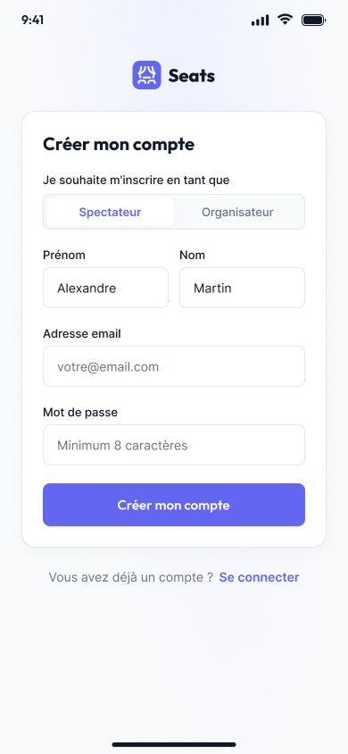

### Maquettes 2 :  Pages Connexion
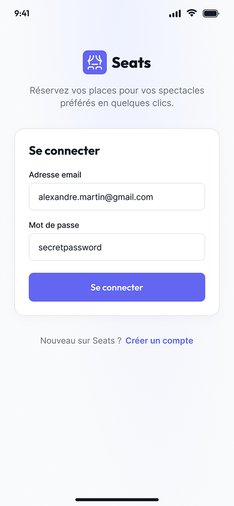

### Maquettes 3 :  Listes des évenements
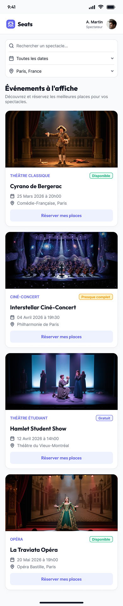

### Maquettes 4 :  Plan de Salle Interactif
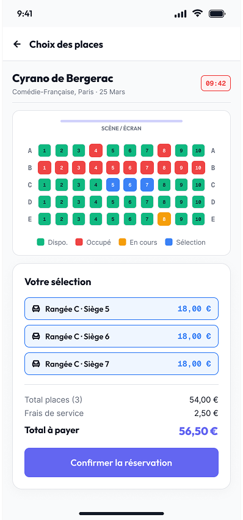

### Maquettes 5 :  Confirmation de Réservation
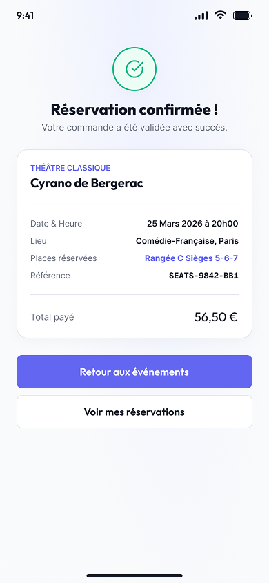

### Maquettes 6 :  Pages Mes Réservations
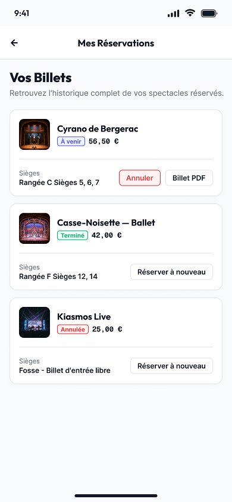

### Maquettes 7 :  Dashboard Organisateur
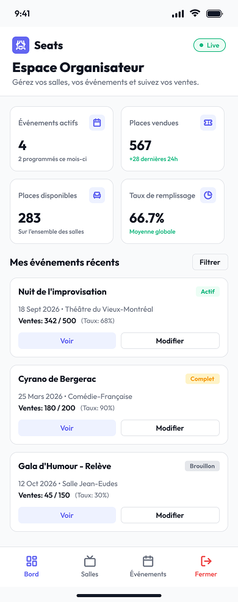

### Maquettes 8 :  Création d'un Évènement
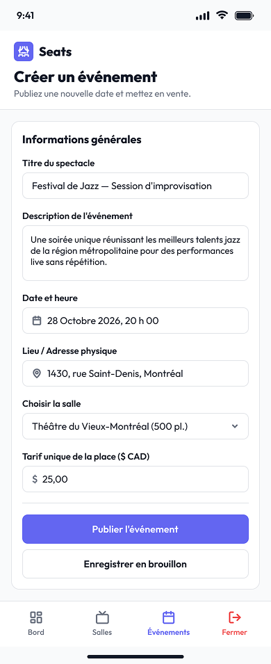

### Maquettes 9 :  Créer une Salle
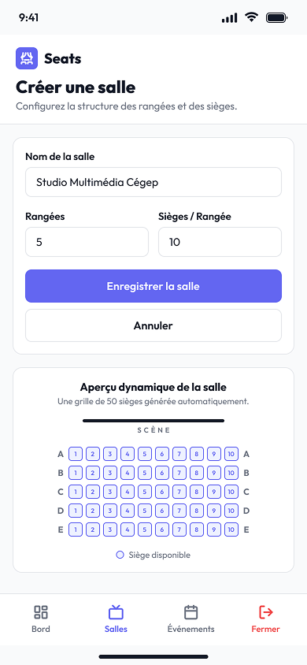

### Maquettes 10 :  Dashboard Admin
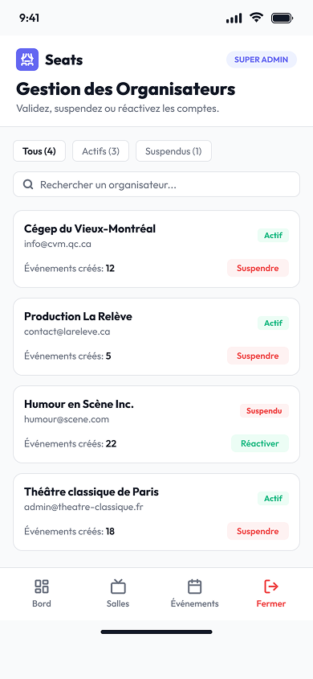

### Maquettes 11 :  Dashboard Admin confirmation
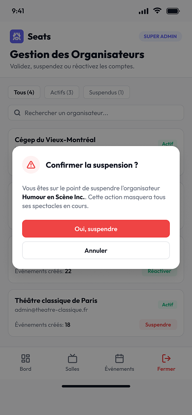

 
## 4. Registre de Décisions Techniques
 
### Décision 1 : Authentification — JWT vs Session
 
**Question** : Comment gérer l'authentification et la persistance de session?
 
**Options envisagées** :
1. **JWT (token stateless)** : Génère un token signé, stocké côté client. Pas d'état serveur.
2. **Session serveur + cookies** : Stocke session sur serveur, cookie de session côté client.
 
**Choix** : **JWT + HttpOnly Cookies**
- Token JWT signé, payload contient `userId`, `role`
- Cookie `HttpOnly` (non accessible en JS, protection XSS)
- Durée courte (1h), refresh token pour renouvellement (optionnel)
 
**Raison** : 
- Simple pour API REST et stateless
- Scalable si besoin multi-serveurs
- Compatible WebSocket (futur Sprint 2)
 
**Coût** :
- Plus complexe à révoquer immédiatement (on attend l'expiration)
- Nécessite HTTPS en production
- Gestion de refresh token au Sprint 2+
 
---
 
### Décision 2 : Modèle de Données — Places Immuables vs Flexibles
 
**Question** : `places_totales` d'une projection doit-il être modifiable après création?
 
**Options envisagées** :
1. **Immuable** : Une fois la projection créée, `places_totales` est figé. Pas d'édition.
2. **Mutable** : Admin peut changer le nombre de places (ex: ajouter une salle, réduire après quelques réservations).
 
**Choix** : **Immuable**
 
**Raison** :
- Évite les incohérences (si 40 places sur 50 sont réservées, réduire à 30 créerait un conflit)
- Simplifie le calcul de `places_disponibles` = `places_totales - COUNT(réservations confirmées)`
- Admin crée une nouvelle projection s'il faut changer capacité
 
**Coût** :
- Moins flexible, mais acceptable au MVP
- Si besoin futur, créer migration et logique de gestion d'overbooking (Sprint 3+)
 
---
 
### Décision 3 : Gestion d'Images — Upload Local vs Cloud Storage
 
**Question** : Où et comment stocker les affiches de films?
 
**Options envisagées** :
1. **Local** : Serveur stocke images dans `/public/uploads/`
2. **Cloud (S3, Cloudinary, Supabase)** : Tiers externe, CDN inclus
3. **URL externe** : Admin fournit URL directement
 
**Choix** : **URL externe + Cloud Storage optionnel au Sprint 2**
- Sprint 1 : Admin passe une URL (ex: depuis TMDb, IMDB, ou local temporaire)
- Sprint 2+ : Implémenter S3 / Cloudinary pour upload
 
**Raison** :
- MVP rapide : pas de dépendance externe au Sprint 1
- Données testables sans fichiers
- Clarté : API prête, implémentation upload report
 
**Coût** :
- Admin doit trouver URL valide
- Images cassées si lien tiers expire
- Futur : migration vers S3 obligatoire en production
